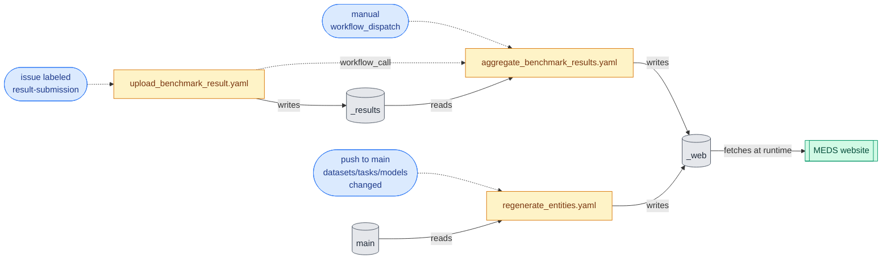

# MEDS_DEV.web — website integration

This module owns the tooling that surfaces datasets, tasks, models, and benchmark results on the
[MEDS website](https://medical-event-data-standard.github.io). Three CLIs plus the supporting
library:

- [`meds-dev-collate-entities`](collate_entities.py) — walk `src/MEDS_DEV/{datasets,tasks,models}/`
    and emit the JSON manifests the website consumes (`datasets.json`, `tasks.json`, `models.json`).
- [`meds-dev-aggregate-results`](aggregate_results.py) — read per-issue `result.json` blobs from
    the `_results` orphan branch and emit the aggregated `all_results.json` the website consumes.
- [`meds-dev-process-submission`](process_submission.py) — extract the fenced ```` ```json ````
    block from a GitHub issue body, validate it against `MEDS_DEV.results.Result`, and write the
    canonical (NaN-sanitized) JSON. Used by `upload_benchmark_result.yaml`.

This README is the runbook for the whole pipeline these CLIs are part of: it explains who fires
them, where their output goes, who reads it, and how to debug or manually trigger the chain. It's
the answer to "why isn't my new submission showing up" and "how do I refresh `_web` after a failed
auto-run".

## Architecture at a glance



**How to read this.** Two kinds of arrows, each with its own meaning:

- **Dashed arrows** are **triggers**: what causes a workflow to start. Events (blue) on the left
    fire workflows (orange) in the middle. The `workflow_call` arrow from Upload to Aggregate is
    the same idea — Upload triggering Aggregate as part of its run.
- **Solid arrows** are **data flow**: which branches a workflow reads from and writes to. So
    `Results -- reads --> Aggregate` means Aggregate checks out `_results`; `Upload -- writes -->   Results` means Upload pushes a new `result.json` to `_results`. The website is a consumer at
    the far right — it fetches `_web` raw URLs at runtime, no build-time dependency.

Walking the submission path: a contributor labels an issue, which fires Upload. Upload writes the
`result.json` to `_results` and then triggers Aggregate via `workflow_call`. Aggregate reads the
full `_results` tree and writes `all_results.json` to `_web`. The website re-reads `_web` on the
next page load.

Walking the source-edit path: a maintainer pushes a dataset / task / model change to `main`. That
fires Regen, which reads the source tree from `main` and writes refreshed `entities/*.json` to
`_web`. Independent of the submission flow.

The Upload → Aggregate chain uses `workflow_call` rather than a `push: branches: [_results]`
trigger on the aggregator because GitHub's `GITHUB_TOKEN` is documented not to fire downstream
workflows on its pushes. `workflow_call` + a job-level `needs:` is the explicit chain that
side-steps this and keeps the run ordered.

## The two orphan branches

These branches share a name with the repo but no shared history with `main`. They're storage, not
code. Don't merge them, don't rebase, don't fast-forward — only the workflows below should write
to them.

### `_results`

Per-issue raw result blobs. Layout:

```
_results/
├── 197/
│   └── result.json
├── 199/
│   └── result.json
└── ...
```

Each `result.json` matches the schema in [`MEDS_DEV.results.Result`](../results/__init__.py)
— `dataset`, `task`, `model`, `timestamp`, `result`, `version`. The directory name is the GitHub issue
number that submitted it.

### `_web`

Aggregated artifacts the website fetches at runtime. Layout:

```
_web/
├── entities/
│   ├── datasets.json
│   ├── tasks.json
│   └── models.json
└── results/
    └── all_results.json
```

- **`entities/*.json`** — auto-generated by [`collate_entities`](collate_entities.py) walking
    `src/MEDS_DEV/{datasets,tasks,models}/`. Schema mirrors the website's
    [`parse_tree.ts`](https://github.com/Medical-Event-Data-Standard/medical-event-data-standard.github.io/blob/main/src/lib/MEDS-DEV/parse_tree.ts) /
    [`types.ts`](https://github.com/Medical-Event-Data-Standard/medical-event-data-standard.github.io/blob/main/src/lib/MEDS-DEV/types.ts).
- **`results/all_results.json`** — produced by [`aggregate_results`](aggregate_results.py) reading
    the `_results` tree. Keyed by issue number; idempotent (existing keys preserved).

## The workflows

| Workflow                                                                                          | Trigger                                                                                                       | Effect                                                                                                                                    |
| ------------------------------------------------------------------------------------------------- | ------------------------------------------------------------------------------------------------------------- | ----------------------------------------------------------------------------------------------------------------------------------------- |
| [`upload_benchmark_result.yaml`](../../../.github/workflows/upload_benchmark_result.yaml)         | Issue labeled `result-submission`                                                                             | Three jobs in sequence: (1) validate the JSON and commit to `_results`; (2) call `aggregate_benchmark_results.yaml`; (3) close the issue. |
| [`aggregate_benchmark_results.yaml`](../../../.github/workflows/aggregate_benchmark_results.yaml) | `workflow_call` (from upload) **or** `workflow_dispatch` (manual)                                             | Rebuilds `_web/results/all_results.json` from the full `_results` tree. Idempotent; pushes only if the aggregate changed.                 |
| [`regenerate_entities.yaml`](../../../.github/workflows/regenerate_entities.yaml)                 | Push to `main` touching `src/MEDS_DEV/{datasets,tasks,models}/**` (or the collator), plus `workflow_dispatch` | Reruns `meds-dev-collate-entities` and pushes `_web/entities/*.json`.                                                                     |

### Concurrency

The submission workflow uses a `concurrency: { group: upload-benchmark-results }` group to
serialize back-to-back label events on a single submission stream — two near-simultaneous
submissions wait for each other instead of racing on `_results`. The aggregator inherits this
serialization because it's a `workflow_call`-chained job; the regen workflow uses
`cancel-in-progress: true` since each run regenerates from main's latest state and a newer run
fully supersedes any in-flight one.

## Schema cheat sheet

### Result blob (`_results/<n>/result.json`)

```json
{
  "dataset": "MIMIC-IV",
  "task": "mortality/in_icu/first_24h",
  "model": "meds_tab/tiny",
  "timestamp": "2025-10-17T17:49:30+00:00",
  "result": {
    "samples_equally_weighted": {
      "roc_auc_score": 0.66,
      "...": "..."
    },
    "subjects_equally_weighted": {
      "...": "..."
    }
  },
  "version": "0.0.15.dev5+g14303bc87"
}
```

`NaN` values in `result` are sanitized to `null` at write time so the JSON is strict. See
`MEDS_DEV.results._sanitize_nan_inf`.

### Entity manifest (e.g., `_web/entities/datasets.json`)

A flat record keyed by entity name (relative path under `src/MEDS_DEV/<datasets|tasks|models>/`):

```json
{
  "MIMIC-IV": {
    "name": "MIMIC-IV",
    "data": {
      "type": "dataset",
      "entity": {
        "<contents of dataset.yaml>": "..."
      },
      "readme": "<contents of README.md>",
      "refs": "<contents of refs.bib>",
      "predicates": {
        "<contents of predicates.yaml>": "..."
      },
      "requirements": [
        "MIMIC-IV-MEDS==0.1.0"
      ]
    },
    "children": []
  }
}
```

Category nodes (parents with a `README.md`) carry only `type` and `readme`, plus a `children` list
naming their descendants. Categories without a README are skipped — direct deeper descendants are
linked under the next category up.

## Adding a new dataset / task / model

After your PR merges to `main`, you don't have to do anything else. The
`regenerate_entities.yaml` workflow picks up the change automatically and pushes a new
`_web/entities/*.json`. The website starts surfacing the new entry on the next page load (cache
TTL aside; see the website's `loadAndCache.ts`).

If the change doesn't appear within a few minutes:

1. Check the latest run of `Regenerate _web Entity Manifests` in Actions.
2. If it didn't fire, your change probably didn't match the path filter
    (`src/MEDS_DEV/{datasets,tasks,models}/**` or the collator). Trigger it manually via
    `workflow_dispatch`.
3. If it ran but produced no commit, the collator decided nothing changed. Verify locally:
    ```bash
    uv run meds-dev-collate-entities --output_dir /tmp/entities --do_overwrite
    diff -u /tmp/entities/datasets.json <(curl -s https://raw.githubusercontent.com/Medical-Event-Data-Standard/MEDS-DEV/_web/entities/datasets.json)
    ```

## Submitting a benchmark result

1. Open a new issue using the **Benchmark Result Submission** template.
2. Paste your JSON between the fenced ```` ```json … ``` ```` block. The label is applied automatically
    by the issue template; if you used a different template, add `result-submission` manually.
3. The workflow validates, commits to `_results`, aggregates into `_web/results/all_results.json`,
    and closes the issue with a confirmation comment.

If the workflow fails (validation rejects the JSON, etc.), it leaves the issue open with the
failure as a checks status. Fix the JSON in a comment or re-edit the issue body and re-trigger by
removing and re-applying the `result-submission` label.

## Manual interventions

| Situation                                                                       | Fix                                                                                                                                               |
| ------------------------------------------------------------------------------- | ------------------------------------------------------------------------------------------------------------------------------------------------- |
| Auto-aggregation didn't run on a submission                                     | `gh workflow run aggregate_benchmark_results.yaml -R Medical-Event-Data-Standard/MEDS-DEV`                                                        |
| Entity manifest is stale (e.g., snuck a change in via a path the filter missed) | `gh workflow run regenerate_entities.yaml -R Medical-Event-Data-Standard/MEDS-DEV`                                                                |
| `_web` got into a bad state                                                     | Diagnose via the workflow logs; in the worst case, re-run both workflows. The aggregator and collator are both idempotent — double-runs are safe. |
